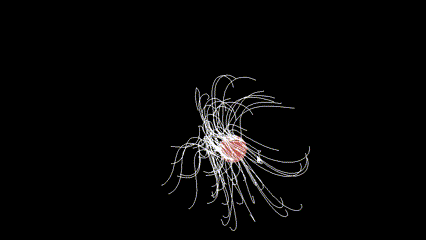

# Electric Monster - Mouse Tracker

This project utilizes Python, Pygame, and mathematical animations to create an **electric monster** that follows the movements of the mouse cursor on the screen. The program features dynamic animations of tentacles that react to mouse movements, providing an interactive experience.

## Features

- Real-time tracking of mouse movements.
- An electric monster effect that responds to the mouse position.
- Smooth tentacle-like animations using **Pygame**.
- **Fullscreen** mode for an immersive experience.

## Demo

Watch the electric monster in action:



## Installation

Follow these steps to set up the project on your local machine:

### Prerequisites

- **Python 3.x**: Make sure you have Python installed. You can download it from [python.org](https://www.python.org/downloads/).
- **Pygame**: Used for rendering and handling graphics.

### Install Required Dependencies

Use `pip` to install the necessary Python libraries:

```bash
pip install pygame
```

### Running the Project

**Run the script**:

   ```bash
   python main.py
   ```

The program will start, open a fullscreen window, and begin tracking the mouse movements. As you move your mouse cursor, you’ll see a monster-like tentacle animation follow the cursor.

## How It Works

1. **Mouse Tracking**: The program captures mouse motion events to determine the position of the mouse cursor in real-time.
   
2. **Tentacle Animation**: Multiple tentacle-like segments are generated, which follow the mouse's movement. These segments adjust their position and angle to simulate tentacles reaching out to the cursor.

3. **Rendering**: **Pygame** is used for drawing the tentacles and rendering the animations on the screen in real-time.

## Controls

- Move your mouse cursor to control the monster's tentacles.
- Press `close` the window to exit the program.


## License

This project is licensed under the MIT License - see the [LICENSE](LICENSE) file for details.

```
MIT License

Copyright (c) 2024 Kian

Permission is hereby granted, free of charge, to any person obtaining a copy
of this software and associated documentation files (the "Software"), to deal
in the Software without restriction, including without limitation the rights
to use, copy, modify, merge, publish, distribute, sublicense, and/or sell
copies of the Software, and to permit persons to whom the Software is
furnished to do so, subject to the following conditions:

The above copyright notice and this permission notice shall be included in all
copies or substantial portions of the Software.

THE SOFTWARE IS PROVIDED "AS IS", WITHOUT WARRANTY OF ANY KIND, EXPRESS OR
IMPLIED, INCLUDING BUT NOT LIMITED TO THE WARRANTIES OF MERCHANTABILITY,
FITNESS FOR A PARTICULAR PURPOSE AND NONINFRINGEMENT. IN NO EVENT SHALL THE
AUTHORS OR COPYRIGHT HOLDERS BE LIABLE FOR ANY CLAIM, DAMAGES OR OTHER
LIABILITY, WHETHER IN AN ACTION OF CONTRACT, TORT OR OTHERWISE, ARISING FROM,
OUT OF OR IN CONNECTION WITH THE SOFTWARE OR THE USE OR OTHER DEALINGS IN THE
SOFTWARE.
```
